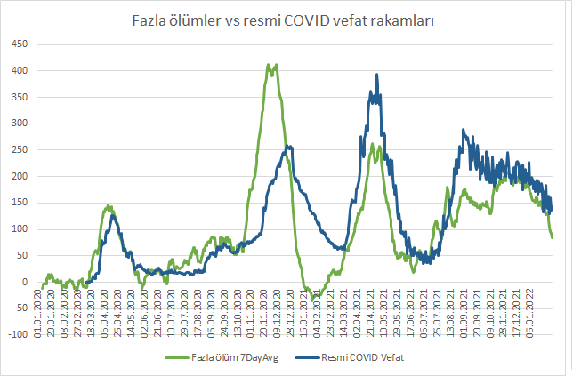
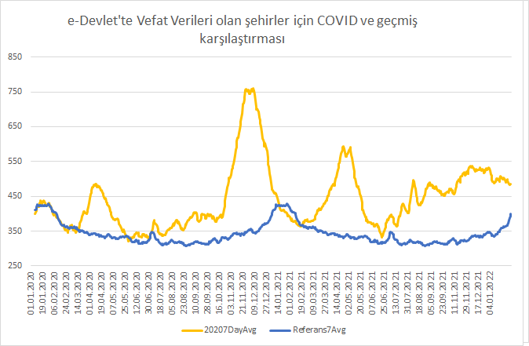
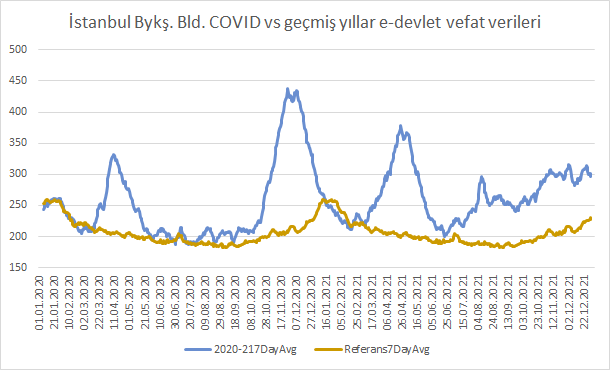
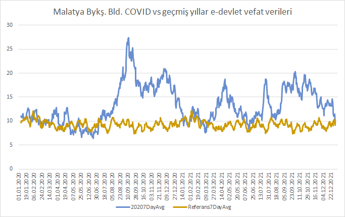
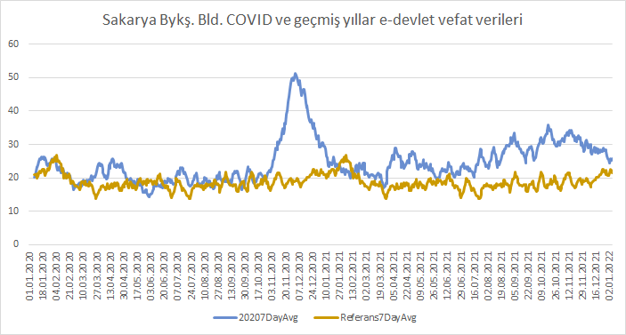
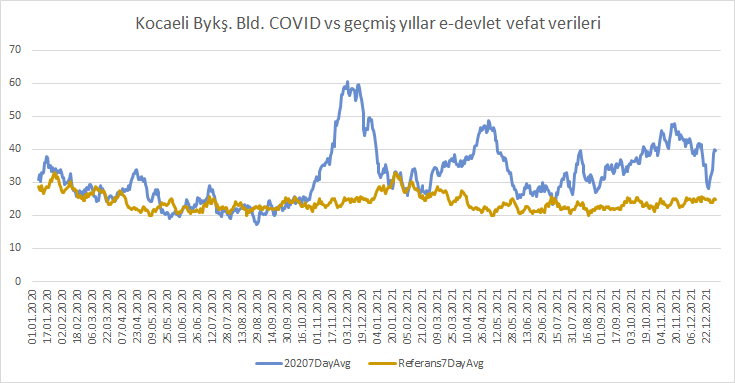
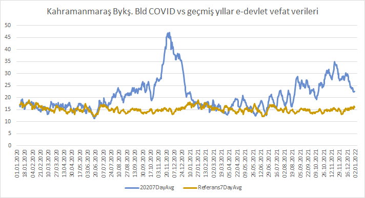
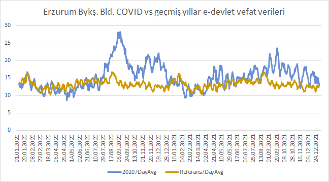

# COVID dönemi edevlet-mezarlik-verileri

2020 yılı itibariyle e-devlet'te mezarlık verileri bulunan iller için geçmiş yıllar ve pandemi dönemi vefat sayıları karşılaştırması. Yani fazla ölümler (excessive deaths)

- **10 il**: Bursa, ~~Diyarbakır~~ (güncellenmiyor), Erzurum, İstanbul, Kahramanmaraş, Kayseri (kod ve veriler [burada](https://github.com/kuzdogan/kayseri-mezarlik-verileri) ) Kocaeli, Konya, Malatya, Sakarya, Tekirdağ

- **10.10.2021** itibariyle:
  - 10 il için yaklaşık **55 bin** fazla ölüm
  - Türkiye geneli resmi **66 bin** covid vefatı

İllerin toplam nufusunu 33% aldığımızda bütün Türkiye'de **150 bin** civarı fazla ölüm varsayılabilir.

Fazla ölümler ve toplam covid vefatları paralel seyretmekle beraber **bütün Türkiye** sayıları 10 il sayılarına yakın seyrediyor. 2020 Eylül-Aralık arası ara ciddi şekilde açılıyor, bu dönem resmi rakamlar mezarlık verileriyle hem miktar hem gidişat olarak uyumsuz. Verilerin devamında ise gidişat benzer olsa da miktarlar uyumsuz.

Toplam mezarlık verileri (covid sonrası vs. öncesi) aşağıdaki gibi

Not: PDF dosyalarını buraya sığmadığı için [Dropbox'a](https://www.dropbox.com/sh/5511va748abm8r0/AAA5cqPwnn8yTaURR8MIiGXwa?dl=0) taşıdım.

# Veriler

Not: .csv dosyalarında 31.12.2020 itibariyle başa dönüldüğü için `VefatSayisi2019` sutunundaki rakamlar aslında bir sonraki yıla denk geliyor. Bu yüzden geçmiş yıllardan baz alınan (2019+2018+2017) ölüm rakamları artmakta. Ham verileri henüz düzeltmedim fakat Excel ve grafiklerde bu veriyi düzelterek hesaplıyorum.

Verilere ve nasıl hesapladığıma `edevlet-mezarlik-verileri.xlsx` dosyasında bakabilirsiniz.

## Şehirlerde fazla ölümler

Şehir bazında COVID vefatları verilmediği için şehir bazında tam karşılaştırma yapamıyorum. Fakat yine de fazla ölümleri gidişat hakkında bilgi vermesi için oluşturdum.

