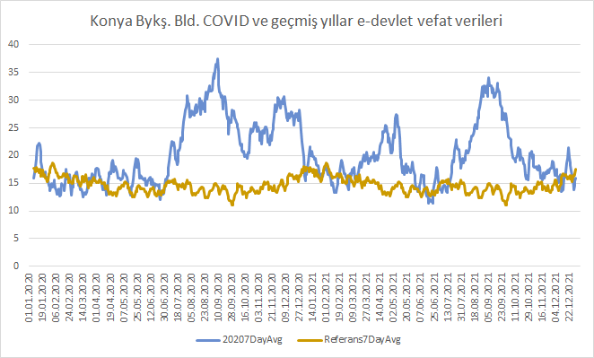
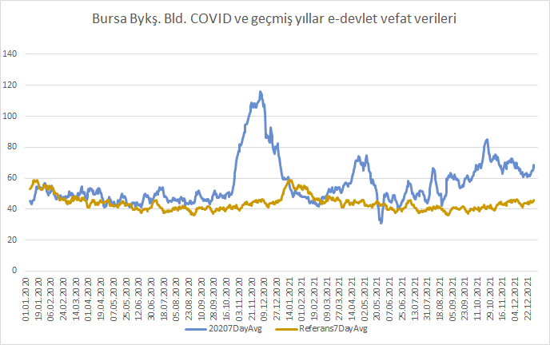
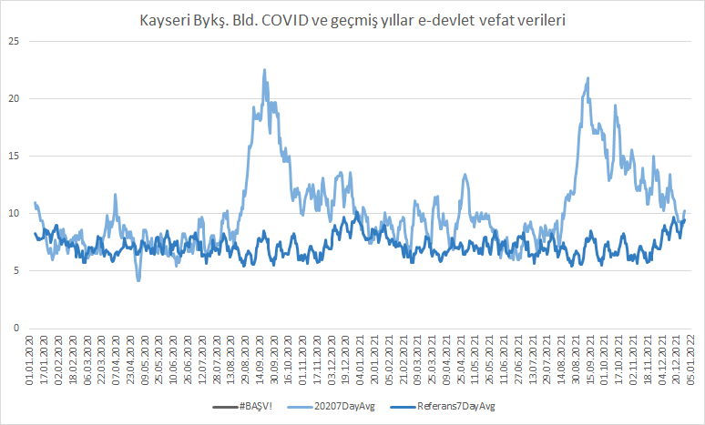

# edevlet-mezarlik-verileri

Türkiye illerinde 2020 yılı ölüm rakamları ile geçmiş yıllardaki ölümlerin karşılaştırılmakta ve (COVID-19 kaynaklı olabilecek) fazla ölümlerin gösterilmektedir.

### Öne çıkanlar:
- Var olan büyükşehir belediye verilerine göre geçtiğimiz yılların ortalamalarına kıyasla 9.900 fazla ölüm gerçekleşmiştir. (13 Eylül)
- Bu geçmiş dönemdeki ölümlere göre yaklaşık 10% bir artışı işaret etmektedir.
- Veri elde edilen il nufusları Türkiye nufusu'nun %37'si, merkez nufusları %28'idir. Büyükşehir belediye nufusları hesaplanamamıştır.
- Resmi rakamlara göre Türkiye geneli COVID ölümleri 7.056'dır (13 Eylül)
- Nisan ayı ölümlerin çoğu İstanbul'da gerçekleşmiştir. Eylül itibariyle artan ölümler Anadolu şehirleri kaynaklı gözükmektedir.
- Diyarbakır'da Eylül 2020'de veri girişi durmuştur.
- Erzurum'da 6 Eylül' 2020'de veri girişi durmuştur.

## Detaylar 
Bu repo'da e-devlet sisteminde Vefat Sorgulama sorgusu bulunan şehirlerden 2020-2017 arasında her günün verisini, her günün sayfa pdf'i ile, çekmeye yarayan script'i ve çekilen ham verileri bulabilirsiniz. 

Güncel haliyle bu şehirlerin verileri mevcuttur: ~~Antalya~~, Bursa, Diyarbakır, Erzurum, İstanbul, Kahramanmaraş, Kocaeli, Konya, Malatya, Sakarya, Tekirdağ

Kayseri iline ait script ve veriler de [burada](https://github.com/kuzdogan/kayseri-mezarlik-verileri) mevcuttur.

Ham veriler edevlet-mezarlik-verileri.xlsx Excel dosyasında toplanmış, temizlenmiş ve hem mevcut toplam şehirlerin hem de her bir şehrin ölüm rakamları sunulmuştur.
Ek olarak 2020 yılında gerçekleşen vefat sayıları ve vefatların 7 günlük ortalaması; geçmiş yıllardaki vefat sayıları 7 günlük ortalaması ile karşılaştırılmış ve gerçekleşen *fazla ölüm* grafikleri çıkarılmıştır.

# Veriler hakkında detaylar

Belirli bir gün için sorgu eğer hata vermiş ise ham veri -1 olarak girilmiştir. Bu durum özellikle Diyarbakır ve Erzurum illerinde sıkça görülmektedir.

### Toplam
### ~~Antalya~~
- Antalya her gün aynı veriyi (100 ölüm) verdiği için yok sayılmalıdır. Yine de .csv'yi ekledim. .xlsx'te dahil değildir.
### Bursa
### Diyarbakır
- Sıklıkla geçersiz veri (-1) olduğu için ortalama alınırken hücre -1 ise ortalamaya dahil edilmemiştir.
- 2017 rakamları 2018 ve 2019'dan çok daha düşük olduğu için ölçüt 2018 ve 2019 alınmıştır.
- 2018 rakamları da Şubat ayına kadar 2017 gibi düşük olduğu için 2018 Şubattan itibaren ortalamaya dahil edilmiştir. Yani geçmiş referans rakam Ocak ayı için yalnızca 2019'dur.
- Eylül itibarı ile bütün yıllar için verilere erişilememektedir.
- Çok sayıda -1 olduğu için fazla ölüm 2020 toplamı - ortalama toplam değil 2020 ve diğer yılların 7günlük ortalama değer farklarından alınmıştır.
### Erzurum
- 6 Eylül itibarı ile bütün yılların verileri erişilmez hale gelmiştir.
- 2020 yılındaki -1 verilerden dolayı fazla ölüm 2020 toplamı - ortalama toplam değil 7günlük ortalama değer farklarından alınmıştır.
### İstanbul
### Kahramanmaraş
### Kocaeli
- 2017 Vefat verileri 21.02 itibariyle sistemde mevcuttur. Bu sebeple o tarihe kadar 19-18 verileri, devamında 19-18-17 verilerini kullanmak için Referans sütunu oluşturuldu.
- 2017 verisi Mayıs'a kadar uyumsuz olduğu için Mayıs'a kadar tablodan çıkarıldı ve dikkate alınmadı.
### Konya
### Malatya
### Sakarya
- 2017 ve 2018 verileri daha düşük olduğu için hesaplamaya katılmadı.
### Tekirdağ
- 2017 ve 2018 verisi fazlasıyla uyumsuz olduğu için dikkate alınmadı
### Kayseri
- Kayseri .xlsx dosyasında mevcut olduğu için açıklama ekliyorum. Kayseri verileri yalnızca 2018 ve 2019 için çekilmiştir.
